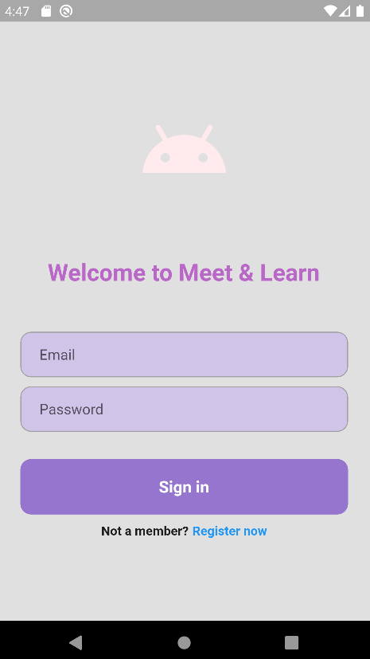
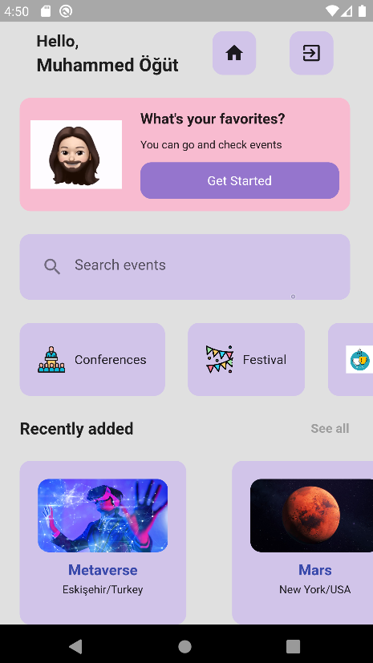
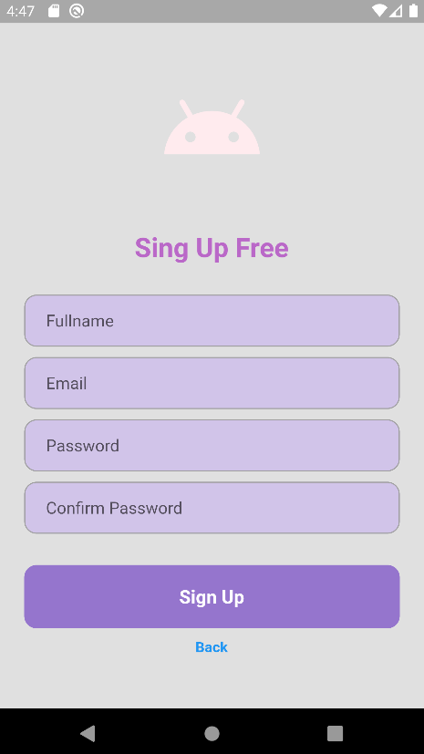
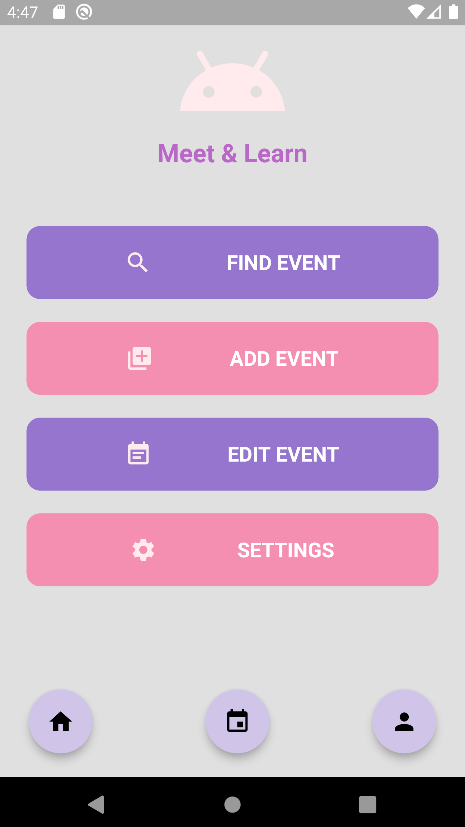
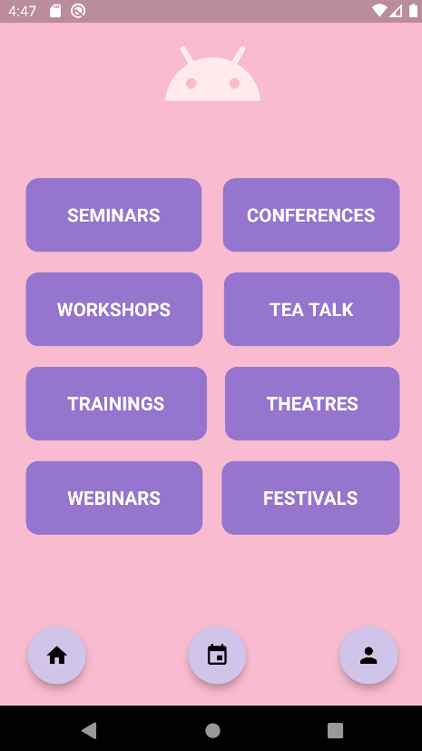
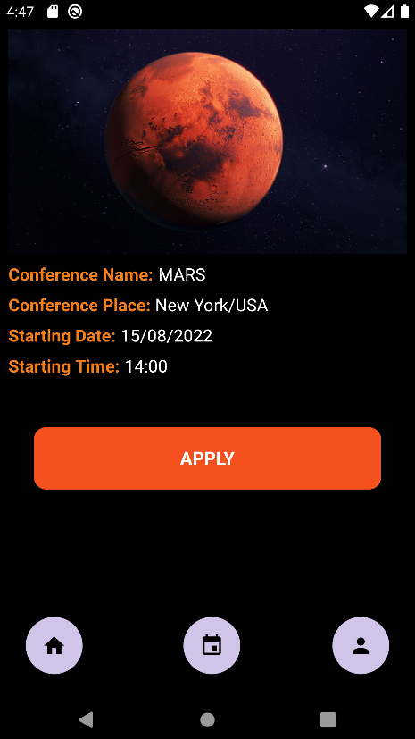
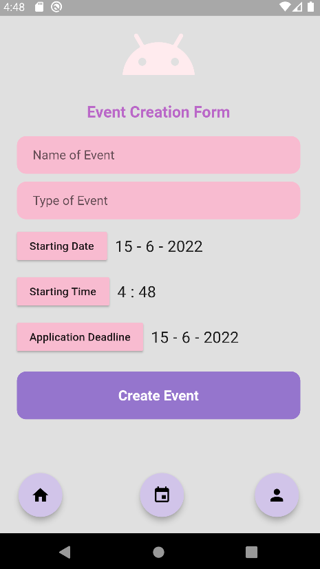
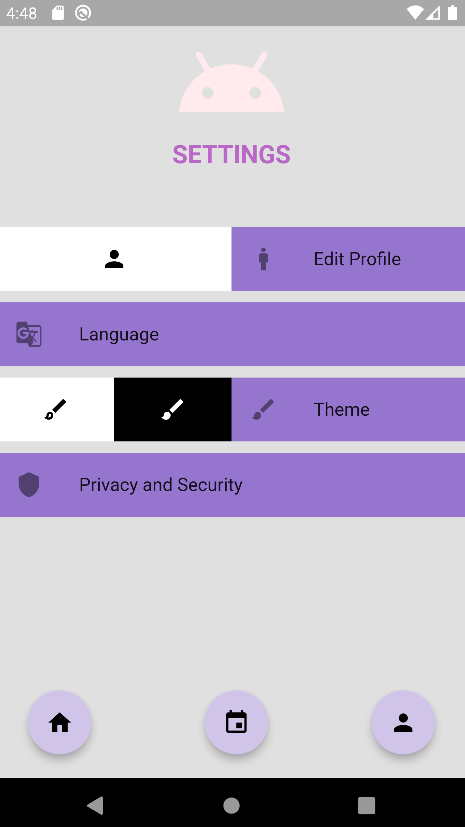

# Meet & Learn
To summarize i created Event application which users can create,search and apply 8 different types of events. For more details you can read vision statement below and see some pictures from application. Also you can watch the video by clicking [here.](https://youtu.be/JNtTexCDot0)

## Vision Statement
### Name of Project:
Meet & Learn

### Introduction and purpose of the project:
Our vision is to enable people to find the activities they need, wonder and enjoy easily and quickly, and enable them to reach large audiences in a short time if they want to organize an event.
When you take some time to think, you realize that sometimes you want to learn something new but don't know where or how to start. For example, improving your language, learning something new about your interests. Sometimes, you get bored with the monotony of life and     seek adventure, but you have no idea what to do. Or you are looking for an activity to do as a family on the weekend, but you do not know how to get information about it. At this point, our application comes to your aid. Thanks to our event finder application, you will be able to get information about the necessary trainings to improve yourself, have the opportunity to laugh at the theater with your family and find yourself at the festival. If you want to take advantage of all these opportunities, this application is for you.

### Major Features:
Our application is user-friendly in design. It is designed to appeal to people of all ages. The functional features of our application will also be aimed at the best use of the application by the user. According to the feedback of the users, our application will be able to meet the new requirements.
The application brings users together with 8 different types of events. These; seminar, conference, theatre, tea-talk, workshop, training, festival and webinar. Users will be able to review the events we have divided into categories, like the events they want to attend, and then apply for the events without wasting time. In addition, the application will provide the user with many features such as creating an event, editing an event if there is one, and applying for events. Users will be able to access many detailed information such as the start date, end date, hours, speakers and training place of the events. Considering that many events are held on online platforms, especially with the effect of the pandemic, the application will give users the opportunity to participate in many events at home and abroad.
To specify the features that distinguish our application from other applications, we have come across applications similar to our activity finder application, but our application is different from other applications in that it supports the user about 8 different types of activities from a single source. In addition, unlike other applications, users will have the opportunity to create events. In addition, many applications are presented to users without categorizing the activities, in our application, the activities will be presented to users in categories. Another
 
feature that makes us stand out is that our application will not only be for a single location, but will be on a global scale.
Our app is a promising app for many reasons. The most important of these is that people need socialization and with this application, people will have the chance to expand their networks easily. The application will present not only domestic but also international events to the user, which will allow access to more users. Finally, in our world where the concept of time is very important, with this application, people will be able to easily access the activities they need without wasting time.

Application             |  Pictures
:-------------------------:|:-------------------------:
  |  
  |  
  |  
  |  
